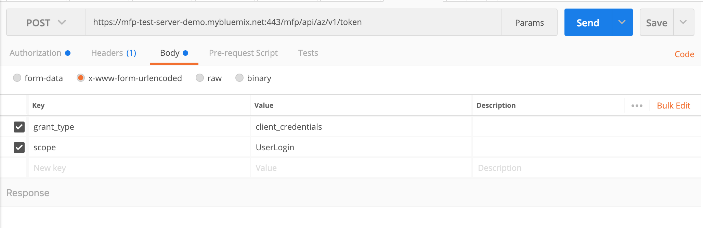
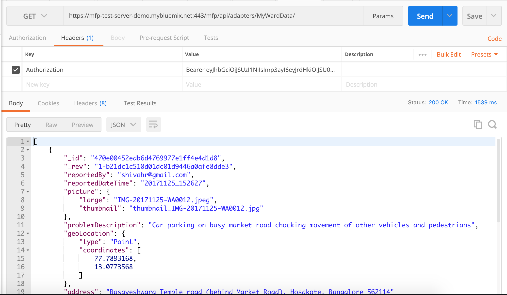

# Deploy the MFP Adapters

## Build and Deploy the MFP adapters

### Build and deploy `UserLogin` adapter as below.

```
$ cd MobileFoundationAdapters/
$ cd UserLogin
$ mfpdev adapter build
$ mfpdev adapter deploy
```

>**Note**: If you have specified `No` to `Make this server the default?` at the time of creating a mobile foundation service, then you need to specify the name of your server profile (`Cloud-MFP` in our case) at the end of `mfpdev adapter deploy` command as shown below.
>```
>$ mfpdev adapter deploy Cloud-MFP
>```

### Build and deploy `MyWardData` adapter as below.

```
$ cd ../MyWardData/
$ mfpdev adapter build
$ mfpdev adapter deploy
```

## Launch MFP dashboard and verify adapter configurations

* Launch MFP Dashboard as below:
    * In the [IBM Cloud dashboard](https://cloud.ibm.com/dashboard/), under `Cloud Foundry Services`, click on the `Mobile Foundation` service you created. The service overview page that gets shown, will have the MFP dashboard embedded within it. You can also open the MFP dashboard in a separate browser tab by appending `/mfpconsole` to the *url* mentioned at the time of creating the mobile foundation service.
    * Inside the MFP dashboard, in the list on the left, you will see the `MyWardData` and `UserLogin` adapters listed.

* Verify MFP Adapter configuration as below:
    * Inside the MFP dashboard, click on the `MyWardData` adapter. Under `Configurations` tab, you should see the various properties for accessing Cloudant database and Cloud Object Storage as shown below. As an alternative to specifying those property values in `MobileFoundationAdapters/MyWardData/src/main/adapter-resources/adapter.xml`, you can deploy the adapters with empty `defaultValue`, and once the adapter is deployed, change the values on this page.

        

    * Click on `Resources` tab. You should see the various REST APIs exposed by `MyWardData` adapter as shown below. The `Security` column should show the protecting scope `UserLogin` against each REST method.
    
        

## Testing Adapter Endpoint

This is an optional step to verify the deployed `MyWardData` adapter endpoint.

### Generate Test Access Token

Follow these steps to generate an `OAuth Token`:

1. Use your HTTP client Postman to make an HTTP POST request to [(MFP-SERVER-HOSTNAME)/mfp/api/az/v1/token](https://<MFP-SERVER-HOSTNAME>/mfp/api/az/v1/token) with the following parameters in `Body` tab. 

    - `Content-Type` - `application/x-www-form-urlencoded`
    - `grant_type` - Set the value to `client_credentials`.
    - `scope` - Set the value to `UserLogin`.

    Replace (MFP-SERVER-HOSTNAME) with fully qualified URL of Mobile Foundation service (for example: https://mfp-test-server-demo.mybluemix.net:443)

    


2. Add an authorization header using `Basic authentication` with Confidential Client ID ("test") and Secret ("test").

    

3. Send the request and the result is a JSON object with a temporary valid access token like below:

    ```
    {
        "access_token": "eyJhbGciOiJSUzI1NiIsImp3ayI6eyJrdHkiOiJSU0EiLCJlIjoiQVFBQiIsImtpZCI6InRlc3QiLCJuIjoiQU0wRGQ3eEFkdjZILXlnTDdyOHFDTGRFLTNJMmtrNDV6Z1p0RGRfcXM4ZnZuWWZkaXFUU1Y0XzJ0Nk9HRzhDVjVDZTQxUE1wSXdtTDQxMFg5SVpudmh4b1lpRmNNU2FPZUlxb2UtckpBMHVadXcyckhoWFozV1ZDZUtlelJWY0NPWXNRTi1tUUswbWZ6NV8zby1ldjBVWXdYa1NPd0JCbDFFaHFJd1ZEd09pZWcySk1HbDBFWHNQWmZrTlpJLUhVNG9NaWktVHJOTHpSV2tNbUx2bTA5aEw1em9zVU5BMTV2ZUNLcGgyV3BtU20yUzYxbkRoSDdnTEVveW1EblRFalBZNUFvaDJpbkktMzZSR1lWTVVVYk80NkNyTlVZdUlvYk9pWGxMekJJaHVJQ3BmVmR4VF94N3N0S1g1QzlCZk1UQjRHa09IUDVjVXY3TnoxZERoSVB1OD0ifX0.eyJpc3MiOiJjb20uaWJtLm1mcCIsInN1YiI6InRlc3QiLCJhdWQiOiJjb20uaWJtLm1mcCIsImV4cCI6MTU0NzgwNzk3NzAwMiwic2NvcGUiOiJSZWdpc3RlcmVkQ2xpZW50IFVzZXJMb2dpbiJ9.RT6Vp3TQ14mo0FSXAuw3rgZPv8xlJvlbTWjrRVQh1IwGsXEBe5om-5E4A0FgcTyyBSYT-qGPCVg7zgQ_tjKex-4cnh94CaHZu_uZBlxPU3eGWycXgRnYfrZWIN5OIvYW3EfY3U_NWBu68eYHru7W49w3TttMh-eS0nv05H4pJOlqm8UxzLcp9K9sxphl8_QQKOBCrtASyvL-5lAtZAN91O5uhyUNdyXT27RqYouQwBVcfyzxKZsqxoG95tlcvP5fsRRDzNee21B6GPEk4KyP9A2IkrGULI6r6j-yqWTngVy5LqIiXgTjzjtCdQyJIHEQLNiWWlLxicE4lsqz5G3HYQ",
        "token_type": "Bearer",
        "expires_in": 3599,
        "scope": "RegisteredClient UserLogin"
    }
    ```

4. Save the above JSON and it is needed while testing adapter endpoint.


### Testing the Adapter endpoint

1. Create a HTTP GET request to [(MFP-SERVER-HOSTNAME)/mfp/api/adapters/MyWardData/](http://<MFP-SERVER-HOSTNAME>/mfp/api/adapters/MyWardData/).

    Replace `(MFP-SERVER-HOSTNAME)` with fully qualified URL of Mobile Foundation service (For example: https://mfp-test-server-demo.mybluemix.net:443)

2. Add an HTTP header with the name `Authorization` and the value of access_token received in previous step (starting with Bearer). Adding test token will make the security framework to skip any security challenges protecting the adapter resource.

3. Send the request to view the adapter response.
    

This way you can ensure that your adapter endpoints for Cloudant and Object Storage working properly.

