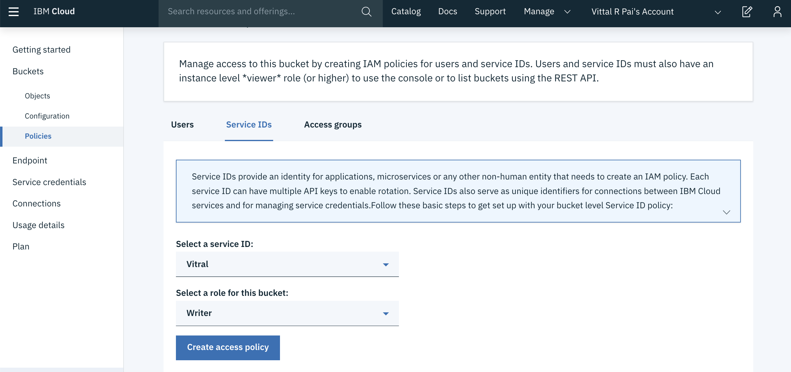

# Installation and Configuration

## Installation

Install the following softare and create service instances as mentioned below:

1. Install `node.js` by downloading the setup from [https://nodejs.org/en/download](https://nodejs.org/en/download) (Node.js 8.x or above). For more information on installation instructions, refer [here](https://nodejs.org/en/download/package-manager/). Check the node version as shown below:

    ```
    $ node --version
    v8.6.0
    ```
2. Install `Cordova` and verify Cordova version. You can download the package from [Cordova](https://cordova.apache.org/docs/en/latest/guide/cli/index.html)

    ```
    $ sudo npm install -g cordova@7.0.1
    $ cordova --version
    7.0.1
    ```
    >**Note**: 
    >* If you are on Windows, instead of using `sudo`, run the above command (and the ones below) in a command prompt opened in administrative mode.
    >* Please refer [MFP documentation](https://mobilefirstplatform.ibmcloud.com/tutorials/en/foundation/8.0/application-development/sdk/cordova/) for compatible versions of Cordova.

3. Install Ionic and check the Ionic version by running the following command.

    ```
    $ sudo npm install -g ionic@3.19.0
    $ ionic --version
    3.19.0
    ```

4. Install IBM Mobile Foundation CLI

    ```
    $ sudo npm install -g mfpdev-cli
    $ mfpdev --version
    8.0.0-2017091111
    ```
    >**Note**: While installing MFP CLI, if you hit an error saying `npm ERR! package.json npm can't find a package.json file in your current directory.`, then it is most likely due to [MFP CLI not being supported in your npm version](https://stackoverflow.com/questions/46168090/ibm-mobile-first-mfpdev-cli-installation-failure). In such a case, downgrade your npm as below, and then install MFP CLI.
        ```
        $ sudo npm install -g npm@3.10.10
        ```

5. Install GIT from [https://git-scm.com/downloads](https://git-scm.com/downloads) and check the version as shown below:
    ```
    $ git --version
    git version 2.9.3 ...
    ```

6. Install Maven.

    On Mac, you can use `brew install` for installing Maven as shown below:
    ```
    $ /usr/bin/ruby -e "$(curl -fsSL https://raw.githubusercontent.com/Homebrew/install/master/install)"
    $ brew install maven
    $ mvn --version
    Apache Maven 3.5.0 ...
    ```

7. Install Java SDK from [http://www.oracle.com/technetwork/java/javase/downloads/index.html](http://www.oracle.com/technetwork/java/javase/downloads/index.html) and check the java version.
    ```
    $ java -version
    java version "1.8.0_101"
    ```

8. Install an [IDE for TypeScript](https://www.typescriptlang.org/index.html#download-links) such as [Atom](https://atom.io/) on Mac.

    After installing [Atom](https://atom.io/), install TypeScript plugin for Atom as shown below.
     ```
    apm install atom-typescript
    ```

9. Download and install Android Studio from [https://developer.android.com/studio/index.html](https://developer.android.com/studio/index.html).

10. Install Postman from [https://www.getpostman.com/downloads/](https://www.getpostman.com/downloads/).

11. Create an [IBM Cloud account](https://cloud.ibm.com/registration), if you don't have one and login with your IBM Cloud credentials.

12. Create a Cloudant database by clicking on `Catalog` and select [*Cloudant*](https://cloud.ibm.com/catalog/services/cloudant) service under `Databases`. Provide a Name and select `Use both legacy credentials and IAM` option under **Available authentication methods**. Click on `Create`.

13. Create an IBM Cloud Object Storage service by clicking on `Catalog` and select [*Object Storage*](https://cloud.ibm.com/catalog/services/cloud-object-storage) service under `Storage`. Click on `Create`.

14. Create an IBM Mobile Foundation service by clicking on `Catalog` and select [*Mobile Foundation*](https://cloud.ibm.com/catalog/services/mobile-foundation) service under `Web and Mobile`. Click on `Create`.

<hr>


## Configuration

### Creating a Cloudant database and populating it with sample data

#### Create Cloudant database

* Log in to [IBM Cloud Dashboard](https://cloud.ibm.com/) with your credentials.
* From the welcome page of Cloudant service that you have created, launch the Cloudant Dashboard.
* In the Cloudant Dashboard, click on `Databases`.
* Click on `Create Database`. Specify name of database as `myward` as shown below. Click `Create`.

    

    Once the database is created, the dashboard will update to show the documents inside `myward` database (which, as expected, will be empty to begin with).

* Click `Create Document`. Under document content, after the auto populated `_id` field, enter grievance details as shown below. Please note that you need to put a comma (,) after the auto populated `_id` field.

    ```java
    {
      "_id": "7fc63023799dfda9582609e75127b4fa",
      "reportedBy": "shivahr@gmail.com",
      "reportedDateTime": "20171125_152627",
      "picture": {
        "large": "IMG-20171125-WA0012.jpeg",
        "thumbnail": "thumbnail_IMG-20171125-WA0012.jpg"
      },
      "problemDescription": "Car parking on busy market road chocking movement of other vehicles and pedestrians",
      "geoLocation": {
        "type": "Point",
        "coordinates": [
          77.7893168,
          13.0773568
        ]
      },
      "address": "Basaveshwara Temple road (behind Market Road), Hosakote, Bangalore 562114"
    }
    ```

* Click `Create Document` to create/save the document.

* Repeat the above steps and create documents for the remaining sample grievances: [SampleData/MyWardGrievance2.json](SampleData/MyWardGrievance2.json), [SampleData/MyWardGrievance3.json](SampleData/MyWardGrievance3.json), [SampleData/MyWardGrievance4.json](SampleData/MyWardGrievance4.json), [SampleData/MyWardGrievance5.json](SampleData/MyWardGrievance5.json), [SampleData/MyWardGrievance6.json](SampleData/MyWardGrievance6.json).

The `myward` database should now list the six documents as shown below under `Table` view.


#### Generate Cloudant API Key

* In the Cloudant Dashboard, under `myward` database, click on `Permissions` and then click on `Generate API Key` as shown in the snapshot below.
* Make a note of the Key and Password generated.
* The newly added key would get listed under Cloudant users with default permission of *reader* only. Select the checkbox under *writer* next to the new key to give it write permission as well.


<hr>

### Create IBM Cloud Object Storage service and populate it with sample data

#### Create IBM Cloud Object Storage

* Log in to [IBM Cloud Dashboard](https://cloud.ibm.com/) with your credentials.

* In the IBM Cloud Object Storage dashboard, select `Buckets` page, click on `Create bucket`. Give a unique name for the bucket. Leave the default selections as-is for *Resiliency* (`Cross Region`), *Location* (`us-geo`) and *Storage class* (`Standard`), and click on `Create` as shown below.

    

* The *Bucket overview* page for the newly created bucket will get shown. Click on `Upload` button and then select `Files`. Select transfer type as `Standard Upload` and select all the images under [SampleData](SampleData) directory (the six images and their thumbnails). Click `Open`. Click on `Upload` as shown below. Once upload is complete, you should see the images listed under your bucket.

    

#### Create Service ID and API Key for accessing objects

* Create Service ID
    - In a separate browser tab/window, launch the *IBM Cloud Identity & Access Management* dashboard using URL https://cloud.ibm.com/iam/. 
    - In case you have multiple IBM Cloud accounts, then select the target Account, Region, Organization and Space.
    - Select `Service IDs` and click `Create`. Give a name and description, and click `Create`.
    - Click on the newly created `Service ID` and make a note of the `Service ID` as shown below.
        

* Add Cloud Object Storage *Writer* role to that service ID
    - Back in *IBM Cloud Object Storage* dashboard, select the newly created `Bucket` under `Buckets`.
    - Click on `Policies`. In the `Service IDs` tab, under `Select a service ID`, select the service ID created in the above step. Under `Select a role to this bucket`, select `Writer`. Click `Create access policy` as shown below. You should get a confirmation dialog saying “Service permission created“.

        

* Create an API Key
    - Back in *IBM Cloud Identity & Access Management* dashboard, under `Service IDs`, click on the service ID created earlier.
    - Under `Access policies`, you should see the `Writer` role for your bucket. 
    - Click on `API keys` tab and then click on `Create` button. In the `Create API key` dialog, give a name and description for the API key and click on `Create`. You should get a confirmation dialog saying `API key successfully created` as shown below.
    - Click on `Download` and save the API key as shown below. Note: This is the only time you will see the key. You cannot retrieve it later.
    - Finally click on `Close`.

        

<hr>

### Configure MFP CLI

* Log in to [IBM Cloud Dashboard](https://cloud.ibm.com/) with your credentials.

* From the welcome page of Cloudant service that you have created, launch the Mobile Foundation Dashboard.

* In the Mobile Foundation service overview page that gets shown, click on `Service credentials`. Expand `View credentials` and make a note of the `url`, `user` and `password` as shown below.

    

  Note: If you are using the Mobile Foundation Developer Kit, the default url would be http://localhost:9080 and username/password would be admin/admin.

* Back on your local machine, configure MFP CLI to work with Mobile Foundation server by running the following command in console.

    >**Note**: For `Enter the fully qualified URL of this server:`, enter the `url` mentioned in credentials followed by `:443` (the default HTTPS port). If you are using the MobileFirst Developer Kit, then enter http://localhost:9080 .

    ```java
    $ mfpdev server add
    ? Enter the name of the new server profile: Cloud-MFP
    ? Enter the fully qualified URL of this server: https://mobilefoundation-71-hb-server.mybluemix.net:443
    ? Enter the MobileFirst Server administrator login ID: admin
    ? Enter the MobileFirst Server administrator password: **********
    ? Save the administrator password for this server?: Yes
    ? Enter the context root of the MobileFirst administration services: mfpadmin
    ? Enter the MobileFirst Server connection timeout in seconds: 30
    ? Make this server the default?: Yes
    Verifying server configuration...
    The following runtimes are currently installed on this server: mfp
    Server profile 'Cloud-MFP' added successfully.
    
    $ mfpdev server info
    Name         URL
    --------------------------------------------------------------------------------------
    Cloud-MFP  https://mobilefoundation-71-hb-server.mybluemix.net:443        [Default]
    --------------------------------------------------------------------------------------
    ```
